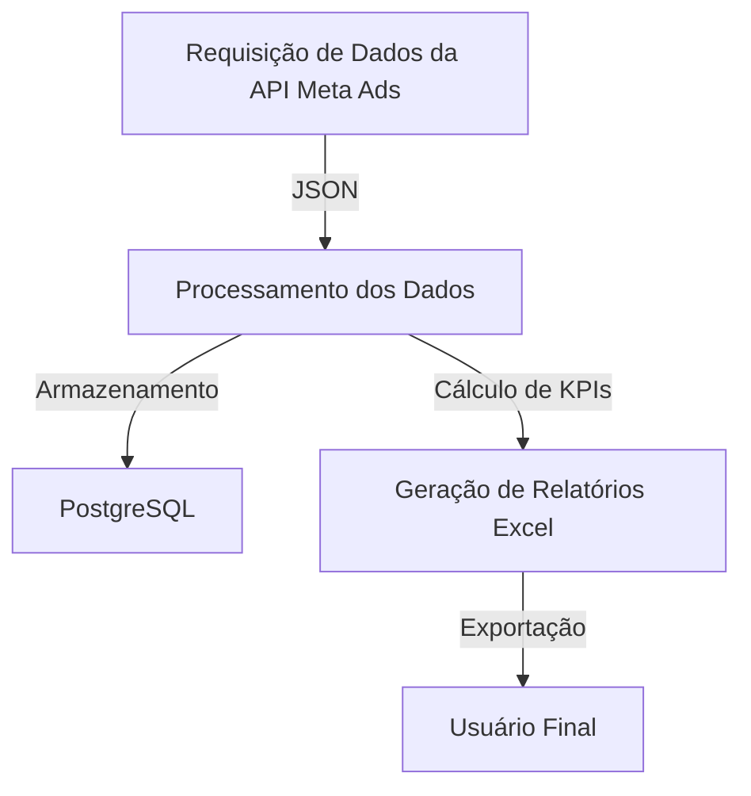

# 📊 Tratamento de Dados - Ser Educacional  

## 📌 Visão Geral
Este projeto realiza **extração, tratamento, armazenamento e análise de dados de campanhas publicitárias** do **Meta Ads API**. Os dados são processados e consolidados em relatórios detalhados no formato Excel, permitindo otimizar estratégias de marketing e tomada de decisão baseada em métricas precisas.

---

## 🎯 Funcionalidades do Projeto  
✔ **Automatização da coleta de dados** via API do Meta Ads.  
✔ **Processamento e estruturação de dados** extraídos em um banco de dados PostgreSQL.  
✔ **Geração de relatórios no formato Excel** com métricas calculadas.  
✔ **Criação e manutenção de um banco de dados** para armazenar os dados tratados.  
✔ **Mescla e manipulação de múltiplos arquivos JSON** em um dataset consolidado.  
✔ **Tratamento de erros e logs** para monitoramento da execução.  

---

## 🛠️ Tecnologias Utilizadas  
| Tecnologia | Descrição |
|------------|--------------------------------|
| **Python** | Linguagem principal do projeto |
| **pandas** | Processamento e análise de dados |
| **requests** | Conexão com a API do Meta Ads |
| **json** | Manipulação de arquivos JSON |
| **PostgreSQL** | Banco de dados para armazenamento estruturado |
| **Excel (.xlsx)** | Exportação dos dados tratados |

---

# 📁 Estrutura do Projeto
````md
📂 TRATAMENTO-DE-DADOS-SER-EDUCACIONAL-2  
├── 📂 Tratamento_dos_dados
│   ├── 📜 base_no_data.py  
│   ├── 📜 main_no_data.py  
│   ├── 📊 processed_data.xlsx  
│
├── 📂 scripts
│   ├── 📜 script_primeiro_request.py  
│   ├── 📜 script_todo_dia.py  
│   ├── 📜 scriptunico.py  
│   ├── 📜 script_mesclar_arquivos.py  
│
├── 📂 Banco de dados
│   ├── 📜 create_database.py  
│   ├── 📜 create_tables.py  
│   ├── 📜 db_conexao.py  
│   ├── 📜 importar_JSON.py  
│
├── 📄 README.md  
````

---

## 📊 **Fluxo do Projeto**  
Abaixo está um diagrama ilustrando o funcionamento do projeto:  



---

# 🚀 Uso do Projeto

## 📌 Pré-requisitos
Antes de começar, instale as bibliotecas necessárias:
```bash
pip install pandas requests psycopg2 openpyxl
```

## 📊 Processamento de Dados
Para executar a coleta e processamento de dados:
```bash
python scripts/script_primeiro_request.py
```
📌 Isso fará a requisição à API do Meta Ads e salvará os dados em JSON.

Para processar os dados extraídos e exportá-los para Excel:
```bash
python Tratamento_dos_dados/main_no_data.py
```
📌 Isso consolidará os dados e gerará um arquivo `processed_data.xlsx`.

---

# 📈 Métricas Calculadas
| **Métrica**                | **Descrição**                                        |
|----------------------------|----------------------------------------------------|
| 📊 **Impressões**          | Quantidade de exibições do anúncio                 |
| 👥 **Alcance**             | Número de usuários únicos alcançados              |
| 💰 **Gastos**              | Valor investido na campanha                        |
| 🖱️ **Cliques**            | Número de cliques nos anúncios                     |
| 🎯 **Leads**               | Quantidade de contatos gerados                     |
| 💵 **CPL (Custo por Lead)** | Custo médio por lead gerado                        |

---

# 📡 Configuração do Meta Ads API

## 🔑 Passos para configurar a API:
1️⃣ **Defina sua chave de acesso do Meta Ads**:
```bash
export META_ACCESS_TOKEN="SEU_TOKEN_AQUI"  # Linux/macOS
$env:META_ACCESS_TOKEN="SEU_TOKEN_AQUI"   # Windows PowerShell
```

2️⃣ **Execute o script para baixar os insights das campanhas**:
```bash
python scripts/scriptunico.py
```

3️⃣ **Os arquivos JSON serão armazenados e processados automaticamente**.

---

# 🛠️ Possíveis Erros e Soluções

### ❌ Erro: `FileNotFoundError`
**Causa:** O arquivo JSON ainda não existe ou está salvo em um local diferente.  
✅ **Solução:** Certifique-se de rodar `script_primeiro_request.py` antes de processar os dados.

### ❌ Erro: `UnicodeDecodeError` ao abrir o JSON
**Causa:** Arquivo salvo com codificação errada.  
✅ **Solução:** Abra o JSON com `utf-8` no código:
```python
with open("arquivo.json", "r", encoding="utf-8") as f:
```

### ❌ Erro: API retornando lista vazia
**Causa:** `time_range` pode estar mal formatado.  
✅ **Solução:** Use `json.dumps()` corretamente:
```python
"time_range": json.dumps({"since": "2022-06-01", "until": "2024-12-31"})
```

---

# 📌 Conclusão
Este projeto automatiza a coleta e análise de dados de campanhas no Meta Ads, garantindo informações estruturadas e relatórios detalhados. 🚀